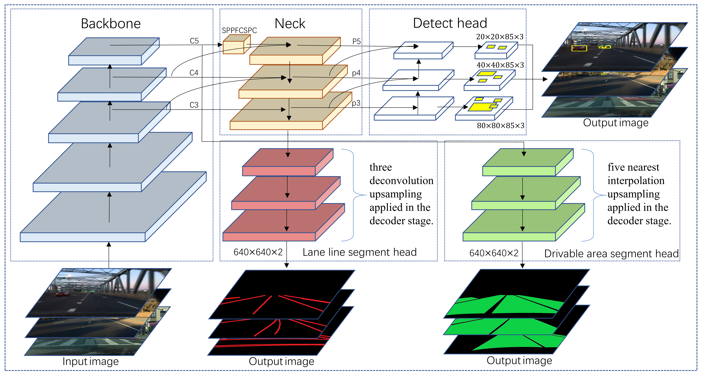
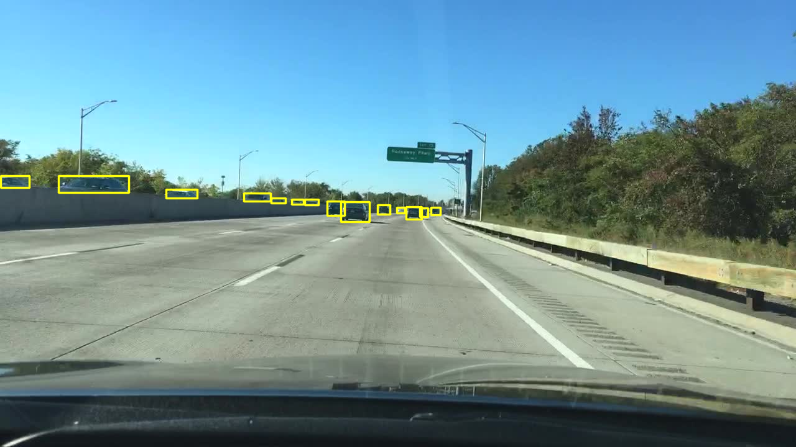
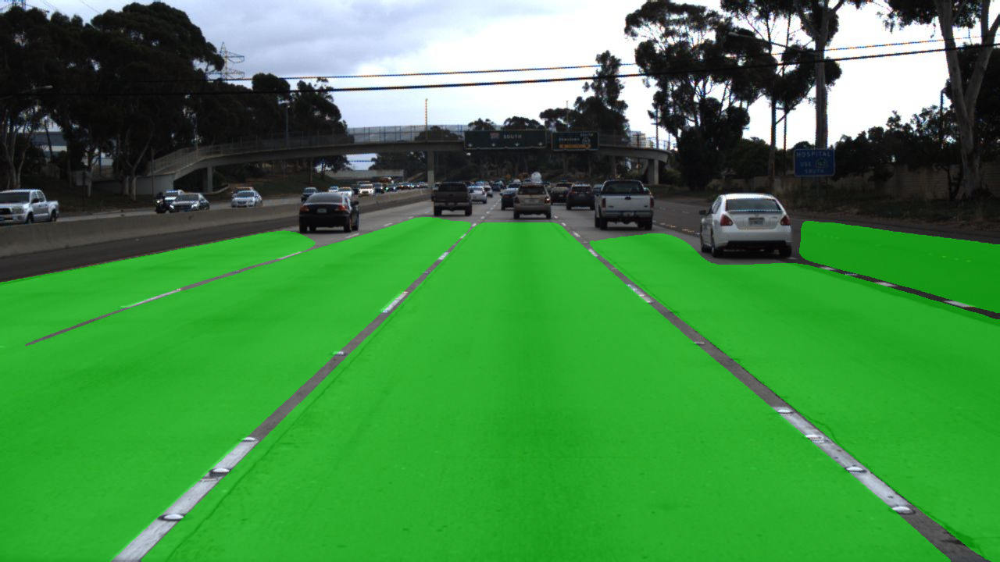
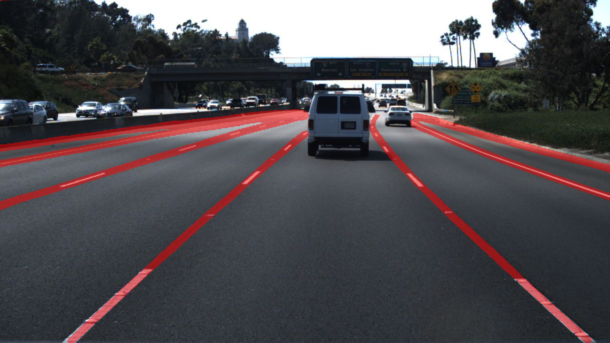
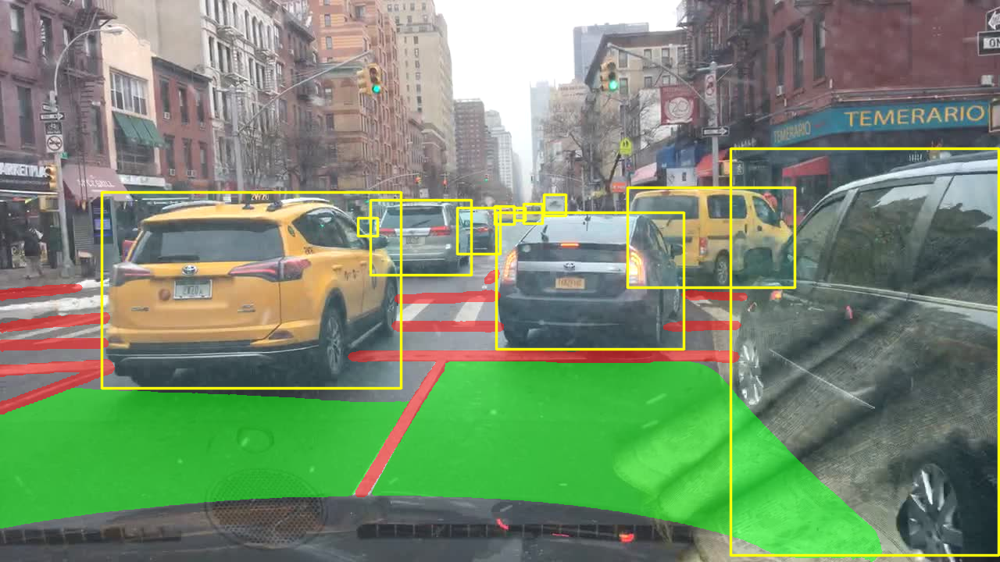
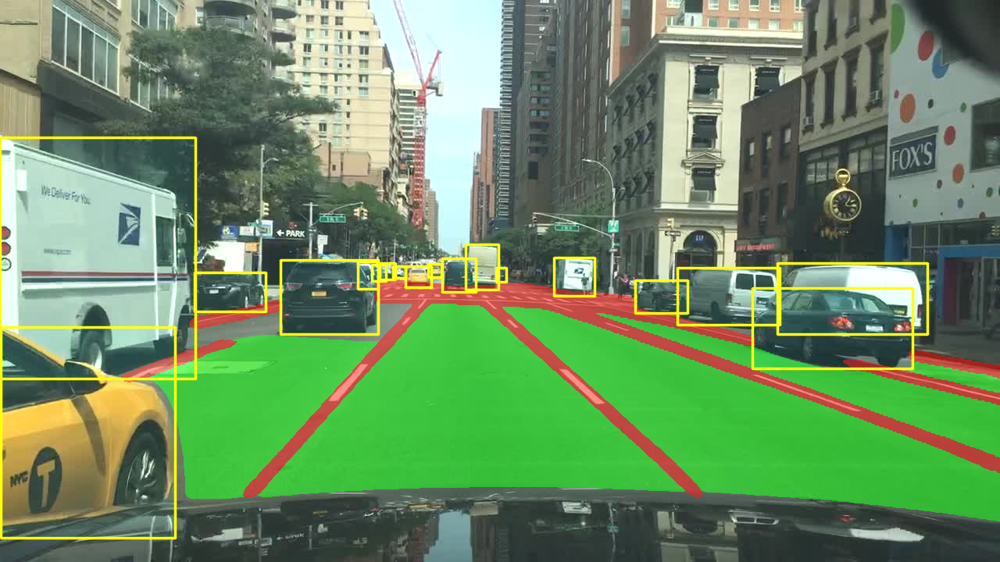
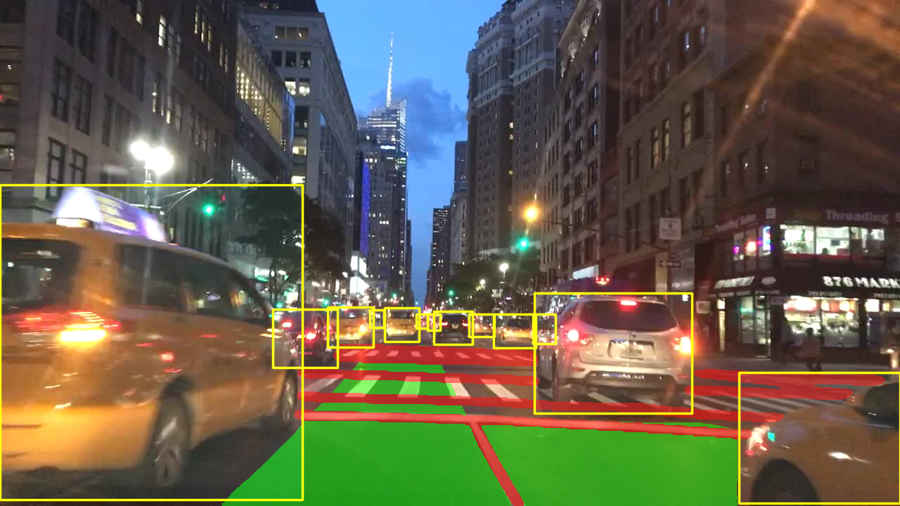
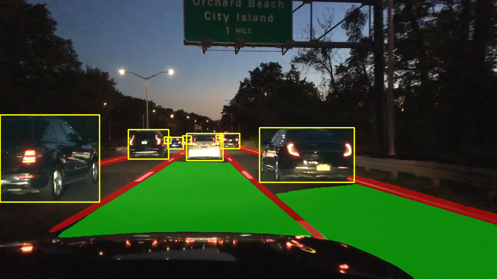

<div align="center">
<h1> MtpNet 💪: Multitask Panoptic Driving  🚗 Perception Network </h1>

[English](README.md) | [简体中文](README.zh-CN.md)
</div>

### Introduction
<div align="center">

  
**Mtpnet Network Architecture.**  

</div>

* MtpNet is an efficient multitasking network used to solve three important tasks in autonomous driving: traffic object detection, drivable area segmentation, and lane detection. 
* In all three tasks, both accuracy and speed have reached advanced levels.

### Results
We used the BDD100K as our datasets,and experiments are run on **NVIDIA 3090**.


### Web Demo
- Integrated into [Huggingface Spaces 🤗](https://huggingface.co/spaces/erlinersi/mtpnet) using Gradio. Try out the Web Demo !
- Integrated into [Inscode Spaces 🤗](https://inscode.csdn.net/) using Gradio. Try out the Web Demo !

### Visualization
Model : trained on the BDD100k dataset and test on the [bilibili: Cam 看世界](https://www.bilibili.com/video/BV1Yb411G7Qo/?share_source=copy_web&vd_source=3237a8995e264302de28705882c9edaf) video.

<table>
    <tr>
        <th>input</th>
        <th>output by yolop</th>
        <th>output by mtpnet</th>
    </tr>
    <tr>
        <td></td>
        <td></td>
        <td></td>
    </tr>
    <tr>
         <td></td>
        <td></td>
        <td></td>
    </tr>
</table>

<table>
    <tr>
        <th colspan="3">Example: output by mtpnet</th>
    </tr>
    <tr>
        <td></td>
        <td></td>
        <td></td>
    </tr>
</table>

### Traffic Object Detection Result
<table>
<tr><th>Result </th><th>Visualization</th></tr>
<tr><td>

|     Model      |  mAP@0.5 (%)   |    Recall (%)    |
|:--------------:|:--------------:|:----------------:|
|   `MultiNet`   |      60.2      |       81.3       |  
|   `DLT-Net`    |      68.4      |       89.4       |
| `Faster R-CNN` |      55.6      |       77.2       |
|   `YOLOv5s`    |      77.2      |       86.8       |
|    `YOLOP`     |      76.5      |       89.2       |   
|  `HybridNets`  |      77.3      |       92.8       | 
|   `YOLOPv2`    |      83.4      |       91.1       |
|  **`MtpNet`**  | **89.8(+6.4)** |  **94.1(+1.3)**  |

</td><td>

</td></tr> 
</table>

### Drivable Area Segmentation
<table>
<tr><th>Result </th><th>Visualization</th></tr>
<tr><td>

|    Model     | Drivable mIoU (%)  |
|:------------:|:------------------:|
|  `MultiNet`  |        71.6        |   
|  `DLT-Net`   |        71.3        | 
|   `PSPNet`   |        89.6        | 
|   `YOLOP`    |        91.5        | 
| `HybridNets` |        90.5        | 
|  `YOLOPv2`   |        93.2        | 
| **`MtpNet`** |   **96.2(+3.0)**   |    

</td><td>

</td></tr> 
</table>

### Lane Line Detection
<table>
<tr><th>Result </th><th>Visualization</th></tr>
<tr><td>

|    Model     |  Accuracy (%)  | Lane Line IoU (%) |
|:------------:|:--------------:|:-----------------:|
|    `Enet`    |     34.12      |       14.64       |
|    `SCNN`    |     35.79      |       15.84       |
|  `Enet-SAD`  |     36.56      |       16.02       |
|   `YOLOP`    |      70.5      |       26.2        |
| `HybridNets` |      85.4      |     **31.6**      |
|  `YOLOPv2`   |      87.3      |       27.2        |
| **`MtpNet`** | **90.1(+2.8)** |    27.9(-3.7)     |
  
</td><td>

</td></tr> 
</table>


### Model parameter and inference speed(fps NVIDIA 3090)
|    Model     | Size |  Params   | Batch4 | Batch8 | Batch16 | Batch32 | Average |
|:------------:|:----:|:---------:|:------:|:------:|:-------:|:-------:|:-------:|
|   `YOLOP`    | 640  |   7.9M    |   50   |   47   |   50    |   44    |   47    |
| `HybridNets` | 640  |   12.8M   |   29   |   32   |   47    |   59    |   41    |
|  `YOLOPv2`   | 640  |   38.9M   |   66   |   79   |   79    |   75    | **74**  |
| **`MtpNet`** | 640  | **50.7M** |   55   |   63   |   65    |   66    |   62    |


### Day-time and Night-time visualization results
<div align = 'None'>
  <a href="./">
  
  
  
  
  </a>
</div>


### Models
You can get the model from <a href="https://github.com/">here</a>.


### Demo Test
You can detect images or videos.

```shell
python demo_onnx.py  --source demo/images/example.png # Identify the specified image
python demo_onnx.py  --source demo/images             # Identify all images in the folder
python demo_onnx.py  --source demo/videos/example.mp4 # Identify designated videos
python demo_onnx.py  --source demo/videos             # Identify all videos in the folder
python demo_onnx.py  --source 0                       # Real recognition through camera
```

### Data preparation

#### Download
- Download the images from [images](https://bdd-data.berkeley.edu/).
- Download the annotations of detection from [det_annotations](https://drive.google.com/file/d/1Ge-R8NTxG1eqd4zbryFo-1Uonuh0Nxyl/view?usp=sharing). 
- Download the annotations of drivable area segmentation from [da_seg_annotations](https://drive.google.com/file/d/1xy_DhUZRHR8yrZG3OwTQAHhYTnXn7URv/view?usp=sharing). 
- Download the annotations of lane line segmentation from [ll_seg_annotations](https://drive.google.com/file/d/1lDNTPIQj_YLNZVkksKM25CvCHuquJ8AP/view?usp=sharing). 


### License

MtpNet is released under the [MIT Licence](LICENSE).


