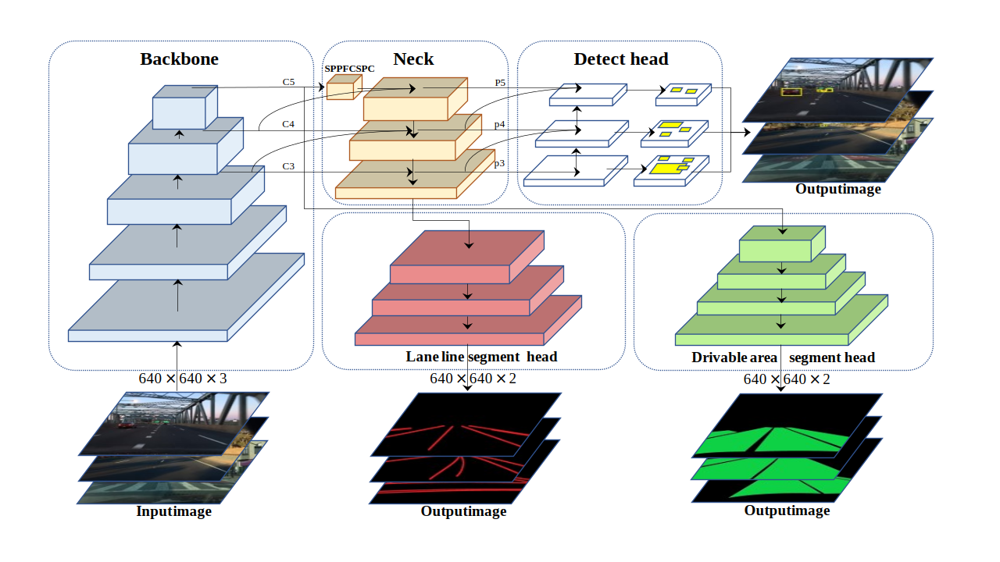

<div align="center">
<h1> MtpNet:💪: Multi-task Panoptic Driving  🚗 Perception Network </h1>

[English](README.md) | [简体中文](README.zh-CN.md)
</div>

### 介绍
<div align="center">

  
**Mtpnet 网络结构.**  

</div>

* MtpNet是一个高效的多任务网络模型，用于解决自动驾驶中的交通目标检测、可驾驶区域分割和车道线检测三个重要任务。
* MtpNet在所有三项任务中无论是在准确性还是速度方面都达到了先进的水平。

### Web 模型演示
- Gradio web 演示 [Huggingface Spaces 🤗](https://huggingface.co/spaces/erlinersi/mtpnet)。 模型demo演示。


### 结果
我们使用BDD100K作为数据集，并在 **NVIDIA 3090** 上进行实验。

### 可视化
Model : 在BDD100k数据集上进行训练，并使用 [bilibili: Cam 看世界](https://www.bilibili.com/video/BV1Yb411G7Qo/?share_source=copy_web&vd_source=3237a8995e264302de28705882c9edaf) 的视频进行检测。

<table>
    <tr>
        <th>input</th>
        <th>output by yolop</th>
        <th>output by mtpnet</th>
    </tr>
    <tr>
        <td></td>
        <td></td>
        <td></td>
    </tr>
    <tr>
         <td></td>
        <td></td>
        <td></td>
    </tr>
</table>
  
<table>
    <tr>
        <th colspan="3">Example: output by mtpnet</th>
    </tr>
    <tr>
        <td></td>
        <td></td>
        <td></td>
    </tr>
</table>


### 交通目标检测结果对比
<table>
<tr><th>Result </th><th>Visualization</th></tr>
<tr><td>

|     Model      |  mAP@0.5 (%)   |    Recall (%)    |
|:--------------:|:--------------:|:----------------:|
|   `MultiNet`   |      60.2      |       81.3       |  
|   `DLT-Net`    |      68.4      |       89.4       |
| `Faster R-CNN` |      55.6      |       77.2       |
|   `YOLOv5s`    |      77.2      |       86.8       |
|    `YOLOP`     |      76.5      |       89.2       |   
|  `HybridNets`  |      77.3      |       92.8       | 
|   `YOLOPv2`    |      83.4      |       91.1       |
|  **`MtpNet`**  | **89.8(+6.4)** |  **94.1(+1.3)**  |

</td><td>

</td></tr> 
</table>

### 可驾驶区域分割结果对比
<table>
<tr><th>Result </th><th>Visualization</th></tr>
<tr><td>

|    Model     | Drivable mIoU (%)  |
|:------------:|:------------------:|
|  `MultiNet`  |        71.6        |   
|  `DLT-Net`   |        71.3        | 
|   `PSPNet`   |        89.6        | 
|   `YOLOP`    |        91.5        | 
| `HybridNets` |        90.5        | 
|  `YOLOPv2`   |        93.2        | 
| **`MtpNet`** |   **96.2(+3.0)**   |    

</td><td>

</td></tr> 
</table>

### 车道线检测结果对比
<table>
<tr><th>Result </th><th>Visualization</th></tr>
<tr><td>

|    Model     |  Accuracy (%)  | Lane Line IoU (%) |
|:------------:|:--------------:|:-----------------:|
|    `Enet`    |     34.12      |       14.64       |
|    `SCNN`    |     35.79      |       15.84       |
|  `Enet-SAD`  |     36.56      |       16.02       |
|   `YOLOP`    |      70.5      |       26.2        |
| `HybridNets` |      85.4      |     **31.6**      |
|  `YOLOPv2`   |      87.3      |       27.2        |
| **`MtpNet`** | **88.7(+1.4)** |    27.8(-3.8)     |
  
</td><td>

</td></tr> 
</table>


### 模型参数和推理速度对比(fps NVIDIA 3090)
|    Model     | Size |  Params   | Batch4 | Batch8 | Batch16 | Batch32 | Average |
|:------------:|:----:|:---------:|:------:|:------:|:-------:|:-------:|:-------:|
|   `YOLOP`    | 640  |   7.9M    |   50   |   47   |   50    |   44    |   47    |
| `HybridNets` | 640  |   12.8M   |   29   |   32   |   47    |   59    |   41    |
|  `YOLOPv2`   | 640  |   38.9M   |   66   |   79   |   79    |   75    | **74**  |
| **`MtpNet`** | 640  | **50.7M** |   55   |   63   |   65    |   66    |   62    |


### 白天和夜晚的可视化结果
<div align = 'None'>
  <a href="./">
  
  
  
  
  </a>
</div>


### 模型
你可以点击<a href="https://huggingface.co/spaces/erlinersi/mtpnet/resolve/main/weights/mtpnet.onnx?download=true">这里</a>获取模型。


### Demo Test
你可以检测图片或者视频。

```shell
python demo_onnx.py  --source demo/images/example.png # 对指定的图片进行识别
python demo_onnx.py  --source demo/images             # 对文件夹内的所有图片进行识别
python demo_onnx.py  --source demo/videos/example.mp4 # 对指定的视频进行识别
python demo_onnx.py  --source demo/videos             # 对文件夹内的所有视频进行识别
python demo_onnx.py  --source 0                       # 通过摄像头实识别
```

### 数据准备

#### 下载
- 从 [images](https://bdd-data.berkeley.edu/)下载图片数据集
- 从 [det_annotations](https://drive.google.com/file/d/1Ge-R8NTxG1eqd4zbryFo-1Uonuh0Nxyl/view?usp=sharing)下载检测任务的标签
- 从 [da_seg_annotations](https://drive.google.com/file/d/1xy_DhUZRHR8yrZG3OwTQAHhYTnXn7URv/view?usp=sharing)下载可行驶区域分割任务的标签
- 从 [ll_seg_annotations](https://drive.google.com/file/d/1lDNTPIQj_YLNZVkksKM25CvCHuquJ8AP/view?usp=sharing)下载车道线分割任务的标签


### 许可证

MtpNet is released under the [MIT Licence](LICENSE).


